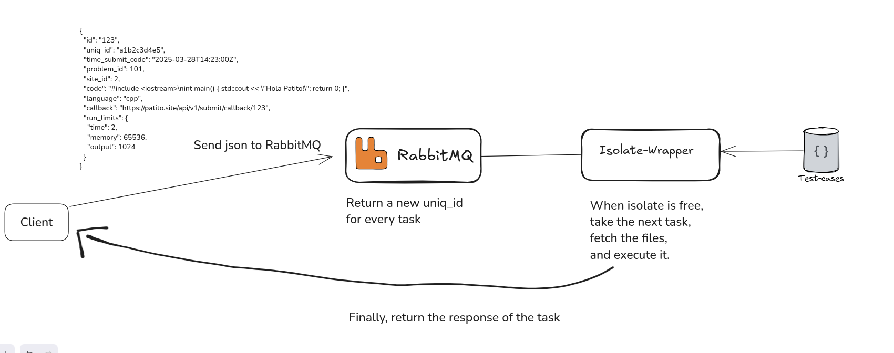

# isolate-wrapper

**isolate-wrapper** is the core evaluation engine for the Patito Virtual Judge.  
It listens to a RabbitMQ queue, receives submitted code, safely runs it using `isolate`, and sends the result back via an async callback.

---

## Installing `isolate`

```bash
sudo apt install pkg-config libcap-dev asciidoc libsystemd-dev
git clone git@github.com:ioi/isolate.git
cd isolate
make
sudo make install

cd systemd
sudo cp * /etc/systemd/system/
sudo systemctl daemon-reload
sudo systemctl enable isolate
sudo systemctl start isolate
```

---

## JSON Task Format

This is the expected format for sending a task to `isolate-wrapper`:

```json
{
  "id": "123456",
  "uniqId": "abc123",
  "boxId": 0,
  "problemId": 1000,
  "language": "cpp",
  "sourceCode": "#include <iostream>\nusing namespace std;\nint main() {\n    int a;\n    cin >> a;\n    cout << a * 10 << endl;\n    return 0;\n}",
  "runLimits": {
    "time": 2,
    "memory": 65536,
    "output": 1024
  },
  "testCases": []
}
```

---

## Testing with Docker Compose

To test the service:

1. Run:

```bash
docker compose run
```

2. Open [http://localhost:15672/](http://localhost:15672/)  
   Username: `guest`  
   Password: `guest`

3. Create a queue named:

```
submission_queue
```

---

## Architecture


